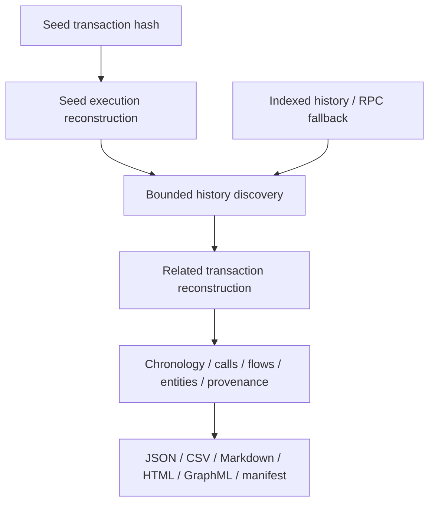

# White Radar

White Radar is a transaction-centric incident reconstruction engine for EVM networks. Given one
confirmed seed transaction from any observed point in a suspected incident, it searches a bounded
window before and after that seed, reconstructs related transactions, and combines execution,
asset movement, contract relationships, proxy context, and evidence provenance into one portable
case bundle.

The primary product is investigation, not universal attack prediction. A secondary quiet guard can
observe explicitly inventoried protocol contracts, but routine mempool activity is aggregated as
telemetry instead of being presented as an incident.

White Radar is read-only. Its RPC boundary contains no wallet, signer, transaction builder,
replacement logic, or broadcast method.

## Primary workflow

```bash
white-radar investigate \
  --chain ethereum \
  --tx-hash 0xCONFIRMED_TRANSACTION_HASH
```

No watchlist entry is required. By default, the seed is expanded backward and forward. The
command:

1. reconstructs the seed transaction from its transaction, receipt, block, trace, logs, verified
   ABI, decoded events, pre/post account and storage changes, proxy state, and historical replay
   evidence;
2. derives an initial frontier from the origin and observed transfer endpoints;
3. queries bounded normal, internal, ERC-20, ERC-721, and ERC-1155 history through Etherscan V2
   when configured, with a portable JSON-RPC block/log fallback;
4. ranks related transaction candidates by observed direction, transfer type, value, and distance
   from the seed;
5. reconstructs each selected transaction with the same per-transaction evidence pipeline;
6. expands linked addresses for a bounded number of hops while deduplicating addresses,
   transactions, and cycles;
7. resolves token name, symbol, and decimals at each transaction block when the contract exposes
   them;
8. produces a chronological candidate incident chain with explicit discovery reasons, source
   provenance, coverage limits, warnings, and integrity hashes.

The default destination is `evidence/<chain>-<transaction-prefix>-reconstruction/`.

## Case bundle

| Artifact | Purpose |
|---|---|
| `case.json` | Canonical machine-readable reconstruction, source cases, limits, coverage, warnings, and provenance |
| `report.md` | Human-readable executive summary, chronology, asset ledger, selector inventory, proxy context, entities, and evidence gaps |
| `transactions.csv` | Seed, pre-seed, same-block, and post-seed transaction inventory with inclusion reasons |
| `calls.csv` | Bounded execution-frame inventory across every reconstructed transaction |
| `events.csv` | Receipt topics, bounded payloads, hashes, and verified-ABI event arguments |
| `transfers.csv` | Native and standard token movement with raw and normalized amounts |
| `state_changes.csv` | Pre/post balances, nonces, and runtime-code evidence for changed accounts |
| `storage_changes.csv` | Pre/post values for changed contract storage slots |
| `entities.csv` | Addresses, inferred kinds, labels, observed roles, and transaction membership |
| `relationships.csv` | Cross-transaction call and transfer edges with evidence references |
| `timeline.csv` | Block/transaction chronology plus execution and asset-flow order |
| `graph.html` | Self-contained interactive address/transaction graph with search, filters, zoom, and evidence details |
| `graph.graphml` | Portable graph for Gephi, Cytoscape, and compatible tools |
| `manifest.json` | SHA-256 and byte size for every bundle artifact |

Call tracing is an enrichment, not a single point of failure. If a provider does not expose
`debug_traceTransaction`, White Radar still produces a case from the transaction, receipt, logs,
top-level value, block context, and ABI evidence. The limitation is recorded in the report.

## Quiet protocol guard

Pending monitoring remains available for protocol-specific baselines:

```bash
white-radar watch-pending --chain ethereum
```

It is intentionally not a generic “live attack detector.” The observer promotes a transaction to a
case only when configured evidence warrants review, such as:

- a selector explicitly marked critical for the protocol;
- a sender outside the protocol baseline;
- a selector outside the protocol baseline;
- native value above the protocol baseline;
- qualifying state-pinned simulation findings.

Routine ERC-20 `transfer`, `approve`, and `transferFrom` calls do not create events, identity-graph
nodes, warnings, or Telegram alerts. They are counted in hourly SQLite telemetry buckets and appear
only as aggregate volume in the digest.

## Installation

Requirements:

- Python 3.11 or newer;
- an HTTP JSON-RPC endpoint for each configured network;
- optional trace-capable RPC access for exact internal calls;
- optional Etherscan API V2 access for verified interfaces and indexed address history;
- a WebSocket RPC only when the quiet pending guard is enabled;
- optional Telegram credentials for promoted guard cases and digests.

```bash
git clone https://github.com/VolodymyrStetsenko/White-Radar.git
cd White-Radar

python3 -m venv .venv
source .venv/bin/activate
python -m pip install --upgrade pip
python -m pip install -e .

white-radar init
```

`init` creates `config.toml`, `watchlist.toml`, `policies.toml`, `.env`, and `data/` without
replacing existing files.

Configure local environment variables with provider URLs, not bare API keys:

```dotenv
RPC_ETHEREUM_HTTP=https://provider.example/v2/local-secret
RPC_ETHEREUM_HTTP_SECONDARY=https://secondary.example/v2/local-secret
RPC_ETHEREUM_WS=wss://provider.example/v2/local-secret
ETHERSCAN_API_KEY=
TELEGRAM_BOT_TOKEN=
TELEGRAM_CHAT_ID=
WHITE_RADAR_DRY_RUN=true
```

`.env` is ignored by Git. Commit only `.env.example` placeholders.

Validate local configuration and RPC identity:

```bash
white-radar doctor
white-radar doctor --online
```

## Investigation options

```bash
white-radar investigate \
  --chain ethereum \
  --tx-hash 0xCONFIRMED_TRANSACTION_HASH \
  --output evidence/my-case
```

Useful controls:

- `--no-trace` skips `debug_traceTransaction` for providers without trace access;
- `--no-state-diff` skips Geth `prestateTracer` diff-mode collection;
- `--no-replay` skips the historical `eth_call` at block minus one;
- `--backward-blocks` and `--forward-blocks` set the search window around the seed;
- `--max-hops`, `--max-transactions`, and `--max-addresses` bound graph expansion;
- `--history-source auto|etherscan|rpc` chooses indexed discovery, portable RPC discovery, or
  automatic fallback;
- `--single-transaction` disables expansion and preserves the original one-transaction workflow;
- `--overwrite` replaces only White Radar's known files in an existing case directory.

The RPC history fallback scans only the requested bounded window. Large windows are intentionally
expensive and should use an indexed history source. Every report records the actual source,
requested window, number of addresses queried, records considered, candidates, failures, and
whether a configured cap was reached.

The original mined trace is primary execution evidence. Historical replay is corroborating evidence
and may differ when a provider lacks archival state or when `eth_call` semantics cannot reproduce a
mined transaction exactly.

## Architecture



The investigator and quiet guard share RPC validation, ABI resolution, proxy inspection, policy,
storage, and reporting primitives. They do not share the same product semantics: investigation
reconstructs a known transaction, while the guard observes only configured protocol behavior.

## Supported evidence

### Cross-transaction reconstruction

- bounded pre-seed, same-block, seed, and post-seed transaction phases;
- normal transactions, internal value records, and standard token-transfer history;
- deterministic candidate scoring and a recorded reason for every included transaction;
- bounded multi-hop address expansion with cycle and transaction deduplication;
- transaction/address graph edges tied to a source transaction and evidence reference;
- explicit coverage classification and warnings rather than an unsupported claim of completeness.

### Execution

- transaction and receipt status;
- block number, hash, timestamp, and transaction fee;
- nested call path, depth, type, sender, recipient, value, gas, selector, and revert evidence;
- bounded calldata, decoded arguments, original byte length, SHA-256, and truncation state per
  traced call;
- contract creation and delegated execution observations;
- exact trace availability and truncation state.

### Events and state changes

- every retained receipt log with emitter, topics, bounded data, original length, and SHA-256;
- event names and arguments only when matched to a verified contract ABI;
- indexed dynamic event values preserved as topic hashes because their original values are not
  recoverable from the log alone;
- bounded Geth `prestateTracer` diff-mode account, balance, nonce, code, and storage changes;
- explicit provider-gap and truncation records instead of treating missing state as unchanged.

### Asset movement

- native value from call frames, with top-level fallback when tracing is unavailable;
- ERC-20 `Transfer` log amounts;
- ERC-721 `Transfer` token identifiers;
- ERC-1155 `TransferSingle` and bounded `TransferBatch` identifiers and amounts;
- mint and burn endpoints through the zero address;
- evidence references back to call paths or receipt log indexes.

### Contract identity

- verified function selectors and bounded static argument decoding;
- EIP-1967 implementation, admin, and beacon state;
- beacon implementation resolution;
- legacy proxy `implementation()` resolution;
- implementation runtime fingerprint and UUPS probe;
- historical runtime byte size and SHA-256 for observed contract entities;
- optional protocol labels from the local inventory.

## Evidence boundary

White Radar now discovers and reconstructs a bounded cross-transaction candidate chain. A public
ledger does not, by itself, prove human identity, intent, common control, or that the earliest and
latest discovered transactions are the true incident boundaries. Mixer semantics, exchange
internal ledgers, privacy systems, off-chain actions, unsupported bridges, unavailable archive
state, provider pruning, and service-address fan-out can create unresolved gaps.

The report therefore distinguishes observed evidence from candidate linkage and records every
limit and source gap. Bridge-aware cross-chain continuation, service/router classification,
checkpoints, revert-data decoding, and public-incident regression fixtures remain tracked in
[ROADMAP.md](ROADMAP.md).

## Additional commands

```bash
# Confirmed protocol inventory scanning
white-radar run-once --chain ethereum
white-radar daemon --chain ethereum

# Quiet pending guard
white-radar watch-pending --chain ethereum

# Proxy and verified ABI inspection
white-radar inspect-proxy --chain ethereum --address 0xCONTRACT
white-radar abi --chain ethereum --address 0xCONTRACT --refresh

# Protocol-state controls
white-radar check-invariants --chain ethereum
white-radar refresh-profiles --chain ethereum --limit 25

# Operations
white-radar status
white-radar digest --hours 24
white-radar health
```

## Engineering controls

- fixed read-only JSON-RPC method allowlist;
- chain-ID validation before analysis;
- bounded call frames, receipt logs, event payloads, state accounts, storage changes, asset
  transfers, ABI destinations, entities, and ERC-1155 batches;
- SQLite WAL, idempotent events, cursors, heartbeats, and alert outbox;
- credential redaction and repository secret scanning;
- deterministic case schema and artifact hashes;
- no transaction construction, signing, replacement, or submission path.

Run the complete local validation suite:

```bash
make check
```

## Documentation

- [Incident investigation](docs/INVESTIGATION.md)
- [Architecture](docs/ARCHITECTURE.md)
- [Detection coverage](docs/DETECTION_COVERAGE.md)
- [Policy and incident operations](docs/POLICY_AND_INCIDENTS.md)
- [Operations](docs/OPERATIONS.md)
- [Threat model](docs/THREAT_MODEL.md)
- [Telegram](docs/TELEGRAM.md)
- [Engineering roadmap](ROADMAP.md)

## License

See [LICENSE](LICENSE).
