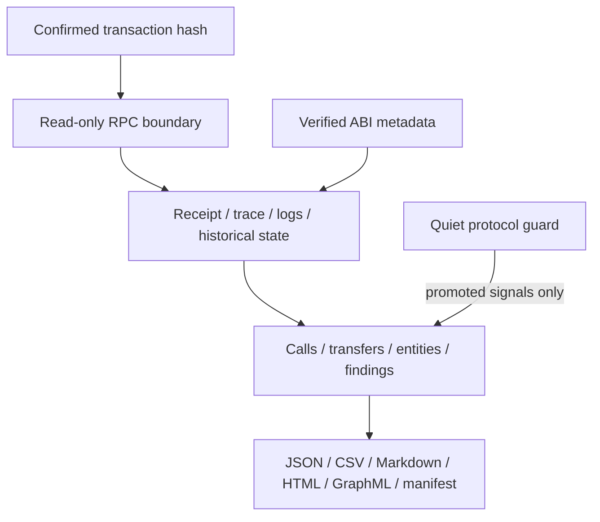

# White Radar

White Radar is a transaction-centric incident investigator for EVM networks. Given one confirmed
transaction hash, it reconstructs execution, asset movement, contract relationships, proxy
context, and evidence provenance into a portable case bundle.

The primary product is investigation, not universal attack prediction. A secondary quiet guard can
observe explicitly inventoried protocol contracts, but routine mempool activity is aggregated as
telemetry instead of being presented as an incident.

White Radar is read-only. Its RPC boundary contains no wallet, signer, transaction builder,
replacement logic, or broadcast method.

## Primary workflow

```bash
white-radar investigate \
  --chain ethereum \
  --tx-hash 0xCONFIRMED_TRANSACTION_HASH
```

No watchlist entry is required. The command:

1. validates the configured RPC chain identity;
2. fetches the transaction, receipt, and containing block, then rejects inconsistent hash or
   block evidence;
3. requests an exact mined `callTracer` trace when the provider supports it;
4. flattens nested `CALL`, `DELEGATECALL`, `STATICCALL`, `CREATE`, and `CREATE2` frames;
5. reconstructs native-value, ERC-20, ERC-721, and ERC-1155 transfers;
6. resolves verified function signatures and proxy implementation context when available;
7. performs a read-only historical replay at transaction block minus one;
8. builds entities, evidence-backed relationships, findings, and a two-phase timeline;
9. writes a hash-manifested case bundle.

The default destination is `evidence/<chain>-<transaction-prefix>/`.

## Case bundle

| Artifact | Purpose |
|---|---|
| `case.json` | Canonical machine-readable transaction, receipt, calls, transfers, entities, findings, and provenance |
| `report.md` | Human-readable investigation summary and evidence index |
| `calls.csv` | Full bounded execution-frame inventory |
| `transfers.csv` | Reconstructed native and standard token movement |
| `entities.csv` | Addresses, inferred kinds, labels, and observed roles |
| `relationships.csv` | Call and transfer edges with evidence references |
| `timeline.csv` | Execution-order calls and receipt-log asset-flow order |
| `graph.html` | Self-contained interactive relationship graph |
| `graph.graphml` | Portable graph for Gephi, Cytoscape, and compatible tools |
| `manifest.json` | SHA-256 and byte size for every bundle artifact |

Call tracing is an enrichment, not a single point of failure. If a provider does not expose
`debug_traceTransaction`, White Radar still produces a case from the transaction, receipt, logs,
top-level value, block context, and ABI evidence. The limitation is recorded in the report.

## Quiet protocol guard

Pending monitoring remains available for protocol-specific baselines:

```bash
white-radar watch-pending --chain ethereum
```

It is intentionally not a generic “live attack detector.” The observer promotes a transaction to a
case only when configured evidence warrants review, such as:

- a selector explicitly marked critical for the protocol;
- a sender outside the protocol baseline;
- a selector outside the protocol baseline;
- native value above the protocol baseline;
- qualifying state-pinned simulation findings.

Routine ERC-20 `transfer`, `approve`, and `transferFrom` calls do not create events, identity-graph
nodes, warnings, or Telegram alerts. They are counted in hourly SQLite telemetry buckets and appear
only as aggregate volume in the digest.

## Installation

Requirements:

- Python 3.11 or newer;
- an HTTP JSON-RPC endpoint for each configured network;
- optional trace-capable RPC access for exact internal calls;
- optional Etherscan API V2 access for verified interfaces;
- a WebSocket RPC only when the quiet pending guard is enabled;
- optional Telegram credentials for promoted guard cases and digests.

```bash
git clone https://github.com/VolodymyrStetsenko/White-Radar.git
cd White-Radar

python3 -m venv .venv
source .venv/bin/activate
python -m pip install --upgrade pip
python -m pip install -e .

white-radar init
```

`init` creates `config.toml`, `watchlist.toml`, `policies.toml`, `.env`, and `data/` without
replacing existing files.

Configure local environment variables with provider URLs, not bare API keys:

```dotenv
RPC_ETHEREUM_HTTP=https://provider.example/v2/local-secret
RPC_ETHEREUM_HTTP_SECONDARY=https://secondary.example/v2/local-secret
RPC_ETHEREUM_WS=wss://provider.example/v2/local-secret
ETHERSCAN_API_KEY=
TELEGRAM_BOT_TOKEN=
TELEGRAM_CHAT_ID=
WHITE_RADAR_DRY_RUN=true
```

`.env` is ignored by Git. Commit only `.env.example` placeholders.

Validate local configuration and RPC identity:

```bash
white-radar doctor
white-radar doctor --online
```

## Investigation options

```bash
white-radar investigate \
  --chain ethereum \
  --tx-hash 0xCONFIRMED_TRANSACTION_HASH \
  --output evidence/my-case
```

Useful controls:

- `--no-trace` skips `debug_traceTransaction` for providers without trace access;
- `--no-replay` skips the historical `eth_call` at block minus one;
- `--overwrite` replaces only White Radar's known files in an existing case directory.

The original mined trace is primary execution evidence. Historical replay is corroborating evidence
and may differ when a provider lacks archival state or when `eth_call` semantics cannot reproduce a
mined transaction exactly.

## Architecture



The investigator and quiet guard share RPC validation, ABI resolution, proxy inspection, policy,
storage, and reporting primitives. They do not share the same product semantics: investigation
reconstructs a known transaction, while the guard observes only configured protocol behavior.

## Supported evidence

### Execution

- transaction and receipt status;
- block number, hash, timestamp, and transaction fee;
- nested call path, depth, type, sender, recipient, value, gas, selector, and revert evidence;
- contract creation and delegated execution observations;
- exact trace availability and truncation state.

### Asset movement

- native value from call frames, with top-level fallback when tracing is unavailable;
- ERC-20 `Transfer` log amounts;
- ERC-721 `Transfer` token identifiers;
- ERC-1155 `TransferSingle` and bounded `TransferBatch` identifiers and amounts;
- mint and burn endpoints through the zero address;
- evidence references back to call paths or receipt log indexes.

### Contract identity

- verified function selectors and bounded static argument decoding;
- EIP-1967 implementation, admin, and beacon state;
- beacon implementation resolution;
- legacy proxy `implementation()` resolution;
- implementation runtime fingerprint and UUPS probe;
- optional protocol labels from the local inventory.

## Remaining scope

The current investigator reconstructs one confirmed transaction completely within the evidence
available from its RPC, receipt logs, and verified metadata. It does not yet discover every later
transaction made by every resulting address. Bounded multi-transaction follow-funds, bridge-aware
continuation, entity labeling, and public-incident regression fixtures remain engineering work and
are tracked in [ROADMAP.md](ROADMAP.md).

This boundary is explicit so that the output does not overstate what one transaction proves.

## Additional commands

```bash
# Confirmed protocol inventory scanning
white-radar run-once --chain ethereum
white-radar daemon --chain ethereum

# Quiet pending guard
white-radar watch-pending --chain ethereum

# Proxy and verified ABI inspection
white-radar inspect-proxy --chain ethereum --address 0xCONTRACT
white-radar abi --chain ethereum --address 0xCONTRACT --refresh

# Protocol-state controls
white-radar check-invariants --chain ethereum
white-radar refresh-profiles --chain ethereum --limit 25

# Operations
white-radar status
white-radar digest --hours 24
white-radar health
```

## Engineering controls

- fixed read-only JSON-RPC method allowlist;
- chain-ID validation before analysis;
- bounded call frames, receipt logs, asset transfers, ABI destinations, entities, and ERC-1155
  batches;
- SQLite WAL, idempotent events, cursors, heartbeats, and alert outbox;
- credential redaction and repository secret scanning;
- deterministic case schema and artifact hashes;
- no transaction construction, signing, replacement, or submission path.

Run the complete local validation suite:

```bash
make check
```

## Documentation

- [Incident investigation](docs/INVESTIGATION.md)
- [Architecture](docs/ARCHITECTURE.md)
- [Detection coverage](docs/DETECTION_COVERAGE.md)
- [Policy and incident operations](docs/POLICY_AND_INCIDENTS.md)
- [Operations](docs/OPERATIONS.md)
- [Threat model](docs/THREAT_MODEL.md)
- [Telegram](docs/TELEGRAM.md)
- [Engineering roadmap](ROADMAP.md)

## License

See [LICENSE](LICENSE).
