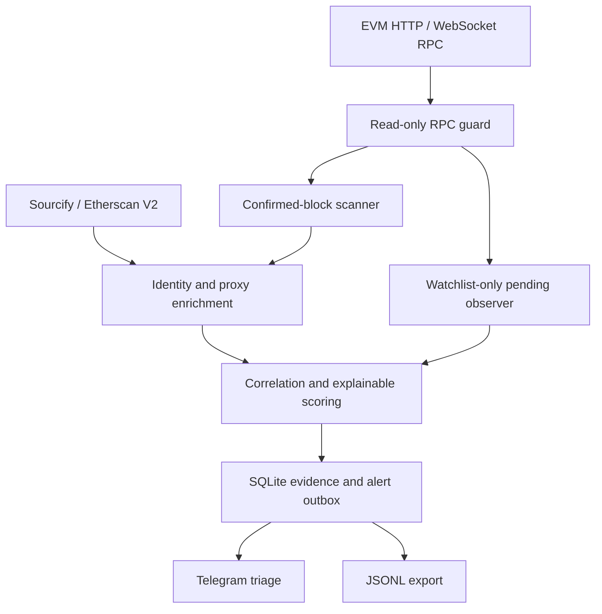

# White Radar

White Radar is a read-only, multi-chain security monitoring and incident-triage system for
EVM protocols. It turns raw deployments, proxy control events, and explicitly scoped pending
transactions into normalized, explainable cases instead of sending low-context address spam.

The current release is a production-oriented monitoring foundation. It does **not** sign,
broadcast, replace, replay, front-run, or copy transactions, and it never accepts a private key.

## What it does

- scans confirmation-safe block ranges on multiple EVM networks;
- detects successful top-level contract deployments;
- enriches contracts with Sourcify, Etherscan API V2, and EIP-1967 proxy state;
- correlates contracts created by the same deployer during a 24-hour release window;
- monitors standard proxy upgrade/admin/beacon events globally or for an allowlisted scope;
- observes pending transactions only when they target explicitly authorized watchlist addresses;
- assigns an explainable priority score with evidence and a recommended next action;
- persists cursors, deployments, cases, and a retryable alert outbox in SQLite;
- sends structured Telegram cases with explorer links and related-contract context;
- emits JSON logs and exports normalized JSONL evidence.

## Safety invariant

The JSON-RPC client uses a fixed allowlist of read methods. Any unapproved method—including
`eth_sendTransaction` and `eth_sendRawTransaction`—raises `ReadOnlyViolation` before a network
request is made. The test suite enforces this invariant.

White Radar is not an autonomous response bot. Moving assets or executing a protocol action
requires the asset owner's prior written authorization, an exact scope, a separately reviewed
response system, and human approval. Public identity, company registration, or an intention to
return funds does not substitute for authorization.

## Architecture



See [Architecture](docs/ARCHITECTURE.md) and [Threat model](docs/THREAT_MODEL.md).

## Quick start

Requirements:

- Python 3.11 or newer;
- an HTTP RPC URL for every enabled chain;
- a WebSocket RPC URL only if pending monitoring is used;
- optional Etherscan and Telegram credentials.

```bash
git clone https://github.com/VolodymyrStetsenko/White-Radar.git
cd White-Radar

python3 -m venv .venv
source .venv/bin/activate
python -m pip install --upgrade pip
python -m pip install -e .

white-radar init
```

`init` creates local `config.toml`, `watchlist.toml`, `.env`, and `data/` only when they do not
already exist. Existing files are preserved.

Add an RPC endpoint to `.env`:

```dotenv
RPC_ETHEREUM_HTTP=https://your-provider-endpoint
WHITE_RADAR_DRY_RUN=true
```

Validate without exposing credential values:

```bash
white-radar doctor
white-radar doctor --online
```

Run one confirmed range:

```bash
white-radar run-once --chain ethereum
```

Run continuously:

```bash
white-radar daemon --chain ethereum
```

## Enabling additional networks

Each `[[chains]]` entry in `config.toml` has its own chain ID, confirmation delay, bounded range,
explorer, and environment-variable names. Set `enabled = true` only after adding the corresponding
HTTP endpoint to `.env` and verifying it with `doctor --online`.

The example configuration includes Ethereum, Base, Arbitrum One, OP Mainnet, Polygon PoS, and
Sepolia. An Alchemy account may expose several networks, but each configured endpoint is still
validated against `eth_chainId`; a mismatched endpoint stops that chain rather than corrupting
state.

## Authorized watchlist

Operational watchlists should stay private. Add only owned contracts, contracted client scope, or
targets explicitly covered by a published vulnerability-disclosure or bug-bounty policy.

```toml
[[contracts]]
chain_id = 1
address = "0x1111111111111111111111111111111111111111"
protocol = "Example Protocol"
role = "proxy"
bounty_url = "https://example.org/security"
contact_uri = "mailto:security@example.org"
critical_selectors = ["0x12345678"]

[[deployers]]
chain_id = 1
address = "0x2222222222222222222222222222222222222222"
label = "Example Protocol release deployer"
```

`critical_selectors` are protocol-supplied triage markers. They do not prove malicious intent.

## Pending monitoring

Pending monitoring is a separate, explicit command and refuses to start without at least one
watchlisted contract on the selected chain:

```bash
white-radar watch-pending --chain ethereum
```

It records only transaction metadata needed for triage: hash, sender, destination, selector,
calldata size, value, and fee fields. It does not store full calldata and cannot broadcast a
transaction.

Provider mempool visibility is partial. Alchemy documents that pending subscriptions expose the
transactions visible in the Alchemy mempool, not a guaranteed view of every transaction in the
network. Therefore White Radar makes no claim of millisecond-complete or universal attack
detection.

## Telegram

Keep `WHITE_RADAR_DRY_RUN=true` until alert previews are correct. Then configure:

```dotenv
TELEGRAM_BOT_TOKEN=
TELEGRAM_CHAT_ID=
WHITE_RADAR_DRY_RUN=false
```

In `config.toml`:

```toml
[telegram]
enabled = true
minimum_score = 60
send_testnet_alerts = false
```

Preview the newest stored case without sending it:

```bash
white-radar preview-alert
```

An alert includes the chain, block, contract, deployer, verification source, contract name,
bytecode size, proxy implementation, related deployment cluster, score reasons, action guidance,
case ID, and direct explorer buttons. See [Telegram alerts](docs/TELEGRAM.md).

## Operations

```bash
white-radar status
white-radar events --limit 20
white-radar export evidence/events.jsonl
```

Docker Compose and a hardened systemd unit are included. Read [Operations](docs/OPERATIONS.md)
before enabling a 24/7 service.

The source can be public because secrets, runtime data, and operational watchlists are excluded. If
the implementation itself must remain confidential, follow [Repository privacy](docs/REPOSITORY_PRIVACY.md)
before adding real operational context.

## Validation

The local suite has no live-network dependency:

```bash
python -m unittest discover -s tests -v
python -m compileall -q src
python scripts/check_secrets.py
```

CI additionally runs Ruff, mypy, pytest, coverage, and secret-pattern checks on Python 3.11 and
3.12.

## Current boundaries

- Top-level deployments are detected. Internal `CREATE`/`CREATE2` coverage requires traces or an
  indexed data source and is planned separately.
- Verification may lag immediately after deployment; a later enrichment worker is on the roadmap.
- Priority is a triage score, not a vulnerability verdict or proof of malicious activity.
- Pending visibility depends on the selected provider and network.
- SQLite is appropriate for a single-node deployment. Horizontal workers require PostgreSQL and a
  queue.
- No automated asset movement, exploit replication, or transaction competition is implemented.

See [Roadmap](ROADMAP.md) for the next engineering milestones.

## Responsible use

Read [Authorization and disclosure](docs/AUTHORIZATION.md) before monitoring a live protocol. In
the United Kingdom, the Crown Prosecution Service guidance on the Computer Misuse Act emphasizes
whether access was authorized and whether the actor knew it was unauthorized. Bug-bounty rewards
and percentages are contractual program terms, not an automatic statutory entitlement.

## Project ownership

White Radar is developed and maintained by **Volodymyr Stetsenko**.

Copyright © 2026 Volodymyr Stetsenko. All rights reserved. See [LICENSE](LICENSE).

## Official references

- [Ethereum JSON-RPC API](https://ethereum.org/developers/docs/apis/json-rpc/)
- [Geth real-time subscriptions](https://geth.ethereum.org/docs/interacting-with-geth/rpc/pubsub)
- [Alchemy pending transaction subscriptions](https://www.alchemy.com/docs/reference/alchemy-pendingtransactions)
- [Alchemy WebSocket best practices](https://www.alchemy.com/docs/reference/best-practices-for-using-websockets-in-web3)
- [Etherscan API V2 introduction](https://docs.etherscan.io/introduction)
- [CPS Computer Misuse Act guidance](https://www.cps.gov.uk/prosecution-guidance/computer-misuse-act)
