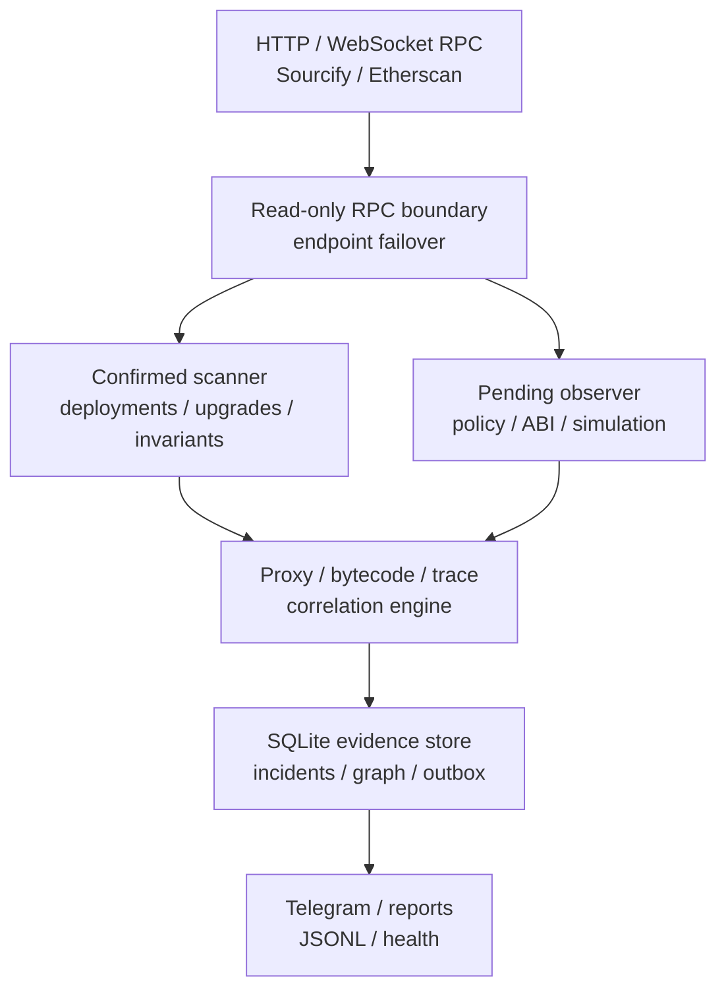

# White Radar

White Radar is a multi-chain protocol-defense monitoring and incident-intelligence platform for
EVM networks. It converts confirmed-chain activity, selected pending transactions, proxy control
state, verified interfaces, protocol invariants, runtime fingerprints, and relationship evidence
into normalized cases that can be investigated and reported.

The engine is deliberately read-only. Its JSON-RPC boundary exposes chain reads, state-pinned
`eth_call`, and bounded debug traces; it contains no wallet, signer, raw-transaction builder, or
broadcast path.

## Capabilities

| Area | Capability |
|---|---|
| Multi-chain ingestion | Independent confirmed-block scanners with chain-ID validation, confirmation delays, cursors, bounded ranges, and HTTP endpoint failover |
| Deployment intelligence | Top-level deployments plus optional trace-backed internal `CREATE` and `CREATE2` discovery for protocol inventory targets |
| Contract intelligence | Sourcify/Etherscan verification, EIP-1967 state, UUPS inspection, runtime-code fingerprints, normalized hashes, and similarity families |
| Pending intelligence | Provider-aware WebSocket subscriptions filtered to configured destinations, local policy evaluation, ABI labels, and optional state-pinned simulation |
| Protocol invariants | Configurable read calls evaluated at the confirmation-safe head, with transition-only violation and recovery events |
| Runtime analysis | `eth_call` outcome, bounded `callTracer` summary, touched-address set, execution depth, delegated calls, creations, value flow, and destructive frames |
| Correlation | Evidence-backed graph relationships across protocols, contracts, deployers, senders, implementations, admins, beacons, and code families |
| Incident operations | Explainable priority, incident SLAs, audited state transitions, Markdown reports, JSONL evidence, Telegram cases, and windowed digests |
| Reliability | SQLite WAL storage, idempotent events, retryable alert outbox, service heartbeats, health checks, reconnect backoff, and endpoint failover |

## System architecture



See [Architecture](docs/ARCHITECTURE.md), [Detection coverage](docs/DETECTION_COVERAGE.md), and
[Threat model](docs/THREAT_MODEL.md).

## Quick start

Requirements:

- Python 3.11 or newer;
- one HTTP JSON-RPC endpoint for each enabled chain;
- a WebSocket endpoint for pending monitoring;
- optional Etherscan and Telegram credentials.

```bash
git clone https://github.com/VolodymyrStetsenko/White-Radar.git
cd White-Radar

python3 -m venv .venv
source .venv/bin/activate
python -m pip install --upgrade pip
python -m pip install -e .

white-radar init
```

`init` creates `config.toml`, `watchlist.toml`, `policies.toml`, `.env`, and `data/`
without replacing existing files.

Configure local environment variables:

```dotenv
RPC_ETHEREUM_HTTP=https://primary-provider-endpoint
RPC_ETHEREUM_HTTP_SECONDARY=https://secondary-provider-endpoint
RPC_ETHEREUM_WS=wss://primary-provider-endpoint
RPC_ETHEREUM_WS_SECONDARY=wss://secondary-provider-endpoint
ETHERSCAN_API_KEY=
WHITE_RADAR_DRY_RUN=true
```

Validate configuration and every configured HTTP endpoint:

```bash
white-radar doctor
white-radar doctor --online
```

Run one bounded confirmed scan:

```bash
white-radar run-once --chain ethereum
```

Run the confirmed scanner continuously:

```bash
white-radar daemon --chain ethereum
```

## Chain and provider configuration

Every `[[chains]]` record defines its chain ID, endpoint environment-variable names,
confirmations, range limits, explorer, pending subscription mode, and trace settings. The example
configuration includes Ethereum, Base, Arbitrum One, OP Mainnet, Polygon PoS, and Sepolia.

Primary and fallback RPC values remain in `.env`. White Radar validates each HTTP endpoint against
`eth_chainId` and rotates to a fallback after transport failure, malformed data, or a missing RPC
method. Deterministic execution errors are returned to the analysis layer instead of being hidden
by failover.

## Protocol inventory

`watchlist.toml` defines the contracts and deployment accounts that receive deeper analysis:

```toml
[[contracts]]
chain_id = 1
address = "0x1111111111111111111111111111111111111111"
protocol = "Example Protocol"
role = "proxy"
bounty_url = "https://example.org/security"
contact_uri = "mailto:security@example.org"
critical_selectors = ["0x12345678"]

[[deployers]]
chain_id = 1
address = "0x2222222222222222222222222222222222222222"
label = "Example Protocol release deployer"
```

Confirmed deployment discovery can remain global. Pending analysis, manual transaction simulation,
and trace-backed internal creation analysis use the protocol inventory to keep expensive processing
bounded and relevant.

## Policy baselines and invariants

`policies.toml` adds contract-specific operating baselines:

```toml
schema_version = 2

[[protocols]]
chain_id = 1
address = "0x1111111111111111111111111111111111111111"
protocol = "Example Protocol"
authorized_senders = ["0x2222222222222222222222222222222222222222"]
allowed_selectors = ["0x12345678"]
critical_selectors = ["0x12345678"]
max_native_value_wei = 0
incident_sla_minutes = 15
selector_labels = { "0x12345678" = "sensitiveOperation(uint256)" }

[[protocols.invariants]]
name = "paused state"
call_data = "0x5c975abb"
decode_as = "bool"
operator = "eq"
expected = false
score = 90
alert_on_error = true
```

Invariant return decoders support `uint256`, `int256`, `address`, `bool`, and `bytes32`.
Operators support `eq`, `ne`, `gt`, `gte`, `lt`, `lte`, `zero`, and `nonzero`.
Checks are pinned to a confirmed block and stored as state. Events are emitted only when an
invariant changes into a violation/error state or recovers.

```bash
white-radar check-invariants --chain ethereum
```

See [Policy and incident operations](docs/POLICY_AND_INCIDENTS.md).

## Pending monitoring and simulation

Start one pending observer:

```bash
white-radar watch-pending --chain ethereum
```

Supported Alchemy networks use a destination-filtered `alchemy_pendingTransactions` subscription
when `pending_subscription = "auto"`. Other endpoints use
`newPendingTransactions`, followed by a read-only lookup and local destination filter.

For each selected transaction, White Radar records only bounded triage metadata. It retains the
selector, calldata size, fee/value fields, and a SHA-256 transaction fingerprint rather than full
calldata.

Enable automatic state-pinned simulation in `config.toml`:

```toml
[analysis]
abi_resolution_enabled = true
pending_simulation_enabled = true
pending_simulation_minimum_score = 70
trace_call_enabled = false
invariant_checks_enabled = true
```

Manual analysis is available for a transaction whose destination is present in `watchlist.toml`:

```bash
white-radar simulate \
  --chain ethereum \
  --tx-hash 0xTRANSACTION_HASH \
  --trace
```

The result includes a pinned block number/hash, execution outcome, return-data size/hash, bounded
call-graph summary, explainable runtime findings, and a deterministic fingerprint. No transaction
is constructed or submitted.

## ABI and proxy intelligence

Resolve and cache a verified selector catalog:

```bash
white-radar abi \
  --chain ethereum \
  --address 0x1111111111111111111111111111111111111111 \
  --refresh
```

The resolver uses Etherscan API V2, computes Ethereum Keccak selectors locally, caps ABI input size
and entry count, and stores a selector map plus the ABI SHA-256. Pending cases can include a verified
function signature and bounded decoding of static arguments.

Inspect proxy state at a specific block:

```bash
white-radar inspect-proxy \
  --chain ethereum \
  --address 0x1111111111111111111111111111111111111111 \
  --block 21000000
```

The snapshot covers EIP-1967 implementation, admin and beacon slots; beacon resolution; effective
implementation runtime fingerprint; and UUPS `proxiableUUID()` compatibility.

## Correlation, reports, and incident workflow

```bash
# Re-enrich code, verification, and proxy state.
white-radar refresh-profiles --chain ethereum --limit 25 --min-age-minutes 10

# Export a bounded evidence graph.
white-radar graph \
  --chain ethereum \
  --address 0x1111111111111111111111111111111111111111 \
  --depth 2

# Render a reproducible incident report.
white-radar report --output evidence/latest-case.md

# Inspect and transition incident state.
white-radar incidents --status new
white-radar incident-transition \
  --incident-id CASE_ID \
  --status acknowledged \
  --actor operator \
  --note "Evidence review started."

# Render a rolling operations digest.
white-radar digest --hours 24
```

The evidence graph records the source of every relationship. The incident state machine records
every transition with its actor, note, prior state, new state, and timestamp.

## Telegram

Configure Telegram only in the ignored `.env` file:

```dotenv
TELEGRAM_BOT_TOKEN=
TELEGRAM_CHAT_ID=
WHITE_RADAR_DRY_RUN=false
```

```toml
[telegram]
enabled = true
minimum_score = 60
send_testnet_alerts = false
```

Preview before delivery:

```bash
white-radar preview-alert
```

Case cards can include protocol/function identity, sender, destination, block, value and fees,
policy findings, simulation status, trace summary, invariant state, proxy implementation, related
deployments, score reasons, case ID, and explorer links. See
[Telegram alerts](docs/TELEGRAM.md).

## 24/7 operation

White Radar ships separate hardened systemd workloads for:

- confirmed scanning;
- one pending observer per chain;
- scheduled profile refresh;
- hourly digest generation;
- heartbeat verification.

```bash
sudo systemctl enable --now white-radar.service
sudo systemctl enable --now white-radar-pending@ethereum.service
sudo systemctl enable --now white-radar-refresh@ethereum.timer
sudo systemctl enable --now white-radar-health.timer
```

Operational visibility:

```bash
white-radar status
white-radar health
white-radar events --limit 20
white-radar export evidence/events.jsonl
```

Docker Compose is also included. See [Operations](docs/OPERATIONS.md) for deployment, backup,
recovery, quota sizing, service isolation, and credential rotation.

## Runtime guarantees

- The RPC client rejects methods outside a fixed read-only allowlist before network dispatch.
- No private-key, seed-phrase, wallet, signing, or transaction-broadcast configuration exists.
- Chain IDs are verified before analysis.
- Confirmed cursors advance only after successful block processing.
- Events and incidents are idempotent.
- Full pending calldata and raw ABI documents are not stored in the operational database.
- Endpoint-bearing exceptions and credentials are not copied into heartbeat records.
- Alert delivery is isolated through a retryable outbox.

## Validation

```bash
ruff format --check .
ruff check .
mypy src
pytest --cov=white_radar --cov-report=term-missing --cov-fail-under=80
python -m compileall -q src
python scripts/check_secrets.py
```

CI runs the same quality gates on Python 3.11 and 3.12.

## Detection boundaries

- Pending visibility is provider-specific and cannot represent every private order flow or builder.
- `eth_call` and `debug_traceCall` model the selected state and provider implementation; they
  are analysis evidence, not a complete prediction of inclusion ordering or future block state.
- Trace methods and historical state availability depend on provider capability and retention.
- On-chain observations can correlate addresses and code but do not establish real-world identity.
- Priority is an explainable triage score, not a vulnerability verdict.
- SQLite targets a single host. Multi-host workers require a transactional shared database and
  queue.

See [Roadmap](ROADMAP.md) for current engineering priorities.

## Project ownership

White Radar is developed and maintained by **Volodymyr Stetsenko**.

Copyright © 2026 Volodymyr Stetsenko. All rights reserved. See [LICENSE](LICENSE).

## Primary references

- [Ethereum JSON-RPC API](https://ethereum.org/developers/docs/apis/json-rpc/)
- [Geth debug namespace](https://geth.ethereum.org/docs/interacting-with-geth/rpc/ns-debug)
- [Geth real-time subscriptions](https://geth.ethereum.org/docs/interacting-with-geth/rpc/pubsub)
- [EIP-1967 proxy storage slots](https://eips.ethereum.org/EIPS/eip-1967)
- [EIP-1822 universal upgradeable proxy standard](https://eips.ethereum.org/EIPS/eip-1822)
- [Etherscan API V2](https://docs.etherscan.io/introduction)
- [OWASP Smart Contract Top 10](https://owasp.org/www-project-smart-contract-top-10/)
- [NIST SP 800-61 Rev. 3](https://csrc.nist.gov/pubs/sp/800/61/r3/final)
