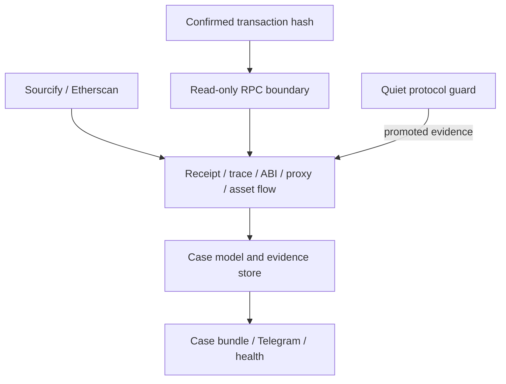

# Architecture

## Design properties

White Radar is built around eight engineering properties:

1. the network boundary is read-only;
2. every analysis result identifies its chain and, where applicable, its pinned block;
3. confirmed ingestion is cursor-based, bounded, idempotent, and confirmation-aware;
4. expensive analysis is constrained by protocol inventory, policy, score, and explicit limits;
5. every priority score contains machine-readable findings and human-readable reasons;
6. delivery failures are isolated from evidence ingestion;
7. runtime health and evidence provenance are queryable.
8. transaction investigation remains useful when optional trace or explorer enrichment is absent.

## Component map

| Component | Responsibility | Principal input |
|---|---|---|
| `JsonRpcClient` | Read-method enforcement, JSON-RPC calls, HTTP failover | Untrusted provider responses |
| Incident Investigator | One-transaction execution, asset-flow, entity, finding, and timeline reconstruction | Confirmed transaction hash |
| Case bundle writer | Canonical JSON, CSV tables, Markdown, HTML/GraphML graph, integrity manifest | Normalized investigation case |
| `ChainScanner` | Confirmed ranges, deployments, control events, invariant cycles | Confirmation-safe chain state |
| `watch_pending_transactions` | Quiet inventory guard, telemetry aggregation, and evidence promotion | Partial provider mempool |
| `ContractEnricher` | Sourcify, Etherscan V2, and EIP-1967 metadata | Explorer and storage reads |
| `AbiResolver` | Verified ABI catalog, Ethereum selectors, static argument decoding | Etherscan API V2 |
| Simulation engine | State-pinned `eth_call`, optional `callTracer`, bounded findings | Selected transaction metadata |
| Proxy inspector | Implementation/admin/beacon state, effective code, UUPS probe | EIP-1967 storage and calls |
| Invariant engine | Typed protocol state checks and transition detection | Policy-defined read calls |
| Fingerprint engine | Raw/normalized hashes and bounded SimHash | Runtime bytecode |
| Trace parser | Internal creation and call-graph extraction | Provider debug traces |
| Policy engine | Sender, selector, value, SLA, labels, and invariants | Bounded TOML policy |
| Correlation engine | Typed nodes and evidence-backed relationships | Chain and operator inventory |
| `RadarStore` | Cursors, profiles, ABI catalogs, invariant state, incidents, outbox | Local SQLite |
| Reporting layer | Investigation bundles, Telegram cards, digests, Markdown reports, JSONL | Cases and normalized events |

## Data flow

## Read-only RPC boundary

`JsonRpcClient` accepts only a fixed method set:

- chain and block reads;
- transaction and receipt reads;
- code, storage, and log reads;
- `eth_call`;
- `debug_traceCall` and `debug_traceTransaction`.

All other method names fail locally with `ReadOnlyViolation`. The client has no method for
constructing, signing, replacing, or broadcasting a transaction.

Each chain can define a primary endpoint and ordered fallbacks. The active endpoint changes after
a transport failure, malformed response, or method-unavailable response. An RPC execution error is
returned directly because it may be part of the evidence.

## Transaction investigation pipeline

1. Validate a confirmed transaction hash and the configured RPC chain identity.
2. Read and cross-check the transaction and receipt hashes.
3. Cross-check the transaction, receipt, and containing-block identities before combining them.
4. Request an exact mined `callTracer` trace when supported.
5. Flatten nested calls into stable bounded paths and resolve verified selectors.
6. Decode native value and standard ERC-20, ERC-721, and ERC-1155 transfer evidence.
7. Inspect root proxy state and resolve implementation ABI context at the transaction block.
8. Classify entities from historical runtime code and observed roles.
9. Build evidence-referenced relationships, findings, and separate execution/asset timelines.
10. Optionally corroborate the result with `eth_call` at transaction block minus one.
11. Write canonical JSON, CSV tables, Markdown, interactive HTML, GraphML, and a SHA-256 manifest.

Trace, explorer, and replay data are optional enrichments. Transaction and receipt evidence remains
available when one of those sources is unavailable. See [Transaction incident
investigation](INVESTIGATION.md).

## Confirmed-block pipeline

1. Validate `eth_chainId`.
2. Read the current head and subtract the configured confirmation delay.
3. Resume from the stored cursor or a bounded lookback.
4. Fetch full transactions for each selected block.
5. Identify successful top-level deployments.
6. Optionally trace inventory-targeted transactions for successful nested `CREATE`/`CREATE2`.
7. Read runtime code and proxy storage at the observed chain state.
8. Resolve verification metadata.
9. Fingerprint runtime bytecode and identify exact or similar code families.
10. Update deployment clusters and identity relationships.
11. Evaluate policy invariants at the confirmation-safe head.
12. Persist normalized events and open qualifying incidents.
13. Advance the cursor after the block completes.
14. Dispatch eligible alert-outbox entries.

The cursor is the last completely processed confirmed block. It never represents an unconfirmed
head.

## Pending pipeline

The pending observer:

1. requires a selected enabled chain and at least one inventory contract;
2. resolves ordered WebSocket endpoints and subscribes with provider-aware semantics;
3. receives full filtered transaction objects or performs a read-only hash lookup;
4. discards destinations outside the inventory;
5. classifies routine token selectors and evaluates protocol-specific policy findings;
6. aggregates low-evidence observations into hourly telemetry without event or graph creation;
7. resolves a verified ABI only after evidence promotes a transaction for review;
8. optionally runs state-pinned simulation after the configured threshold;
9. stores a bounded case and graph evidence only for promoted observations;
10. opens an incident and sends Telegram only when configured priority thresholds are met;
11. writes a heartbeat while the subscription is active and reconnects with bounded backoff.

Pending visibility is intentionally described as provider evidence. It is not a global mempool
consensus view.

Routine ERC-20 `transfer`, `approve`, and `transferFrom` traffic has zero base priority. It is
retained as aggregate volume and cannot create per-transaction identity nodes or Telegram messages
without protocol-specific evidence.

## State-pinned simulation

The simulation engine converts a selected transaction to a JSON-RPC call object containing only
execution-relevant fields. It executes `eth_call` against an explicit block number and records:

- block number and hash;
- `succeeded`, `reverted`, or `unavailable`;
- return-data byte length and SHA-256;
- error class without endpoint text;
- deterministic transaction fingerprint.

When enabled, `debug_traceCall` uses Geth's bounded `callTracer` configuration. The summary caps
frames and touched addresses, then reports call depth, delegated/static calls, contract creation,
destructive frames, value-bearing calls, and reverted frames. Findings contribute bounded score
deltas.

Full calldata and return data are not persisted by this layer.

## Proxy intelligence

Proxy inspection is pinned to one block and reads the EIP-1967 implementation, admin, and beacon
slots. Beacon proxies and legacy/custom direct proxies can be resolved through `implementation()`.
The effective implementation is fingerprinted, checked for runtime code, and probed through
`proxiableUUID()` for UUPS compatibility.

Upgrade events are enriched with the full snapshot so the case records both the event log and the
resulting control state.

## Protocol invariants

An invariant is a policy-defined call, decoder, comparison, expected value, priority, and error
handling rule. The scanner evaluates all invariants for the selected chain at the same
confirmation-safe head. The current result is upserted into `invariant_states`.

An event is created only for a material transition:

- baseline to `violated`;
- baseline to `error` when `alert_on_error = true`;
- violation/error to `ok`.

This stateful model prevents unchanged conditions from generating repeated alerts.

## ABI intelligence

The ABI resolver downloads only verified ABI metadata through Etherscan API V2. Inputs are bounded
to two megabytes and 2,000 entries. Selectors are computed locally with Ethereum Keccak-256.

SQLite stores:

- selector-to-signature catalog;
- source;
- canonical ABI SHA-256;
- refresh timestamp.

The full ABI remains process-local. Static arguments can be decoded for address, Boolean, integer,
and fixed-bytes types; dynamic values are represented by a marker instead of copied into evidence.

## Correlation model

Graph nodes represent protocols, contracts, deployers, senders, implementations, admins, beacons,
and bytecode identities. Relationships include:

- `DEPLOYED`;
- `CONTAINS`;
- `OBSERVED_PENDING_CALL_TO` for promoted guard cases only;
- `DELEGATES_TO`;
- `ADMINISTERED_BY`;
- `USES_BEACON`;
- `BYTECODE_MATCHES`;
- `BYTECODE_SIMILAR_TO`.

Every edge carries the transaction, block, inventory fact, or similarity measurement that supports
it. Neighborhood traversal is bounded to four hops.

## Persistence and incident workflow

SQLite uses WAL mode and uniqueness constraints for event and deployment idempotency. The schema
holds:

- chain cursors;
- deployments and contract profiles;
- ABI catalogs and invariant states;
- graph nodes and edges;
- normalized events;
- aggregated pending telemetry buckets;
- incidents and append-only transition history;
- service heartbeats;
- alert-outbox state.

Incident state transitions are validated by a deterministic state machine. Terminal records remain
in history.

## Failure isolation

- A chain failure affects only that scanner cycle.
- A failed block does not advance its cursor.
- A failed primary RPC rotates to a configured fallback.
- A failed WebSocket reconnects without stopping the confirmed scanner.
- A failed Telegram request leaves the alert pending.
- An unavailable explorer removes enrichment, not the underlying chain event.
- An unavailable trace removes trace findings, not the base transaction observation.
- Heartbeats store exception classes rather than credential-bearing exception text.

## Scaling path

SQLite targets a single-host deployment. A multi-host topology should replace it with PostgreSQL,
introduce a durable work queue, partition scanners by chain, separate enrichment workers from
ingestion, and expose external metrics. That migration should preserve event IDs, evidence
provenance, cursor semantics, and the read-only RPC boundary.
