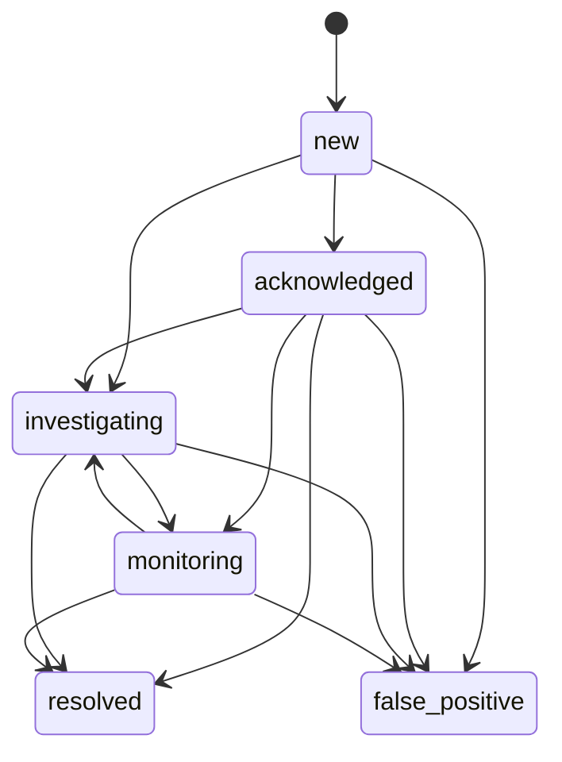

# Policy and incident operations

## Policy schema

Copy `policies.example.toml` to the local `policies.toml`. Each `[[protocols]]` record is
keyed by chain ID and contract address.

```toml
schema_version = 2

[[protocols]]
chain_id = 1
address = "0x1111111111111111111111111111111111111111"
protocol = "Example Protocol"
authorized_senders = ["0x2222222222222222222222222222222222222222"]
allowed_selectors = ["0x12345678"]
critical_selectors = ["0x12345678"]
max_native_value_wei = 0
incident_sla_minutes = 15
selector_labels = { "0x12345678" = "sensitiveOperation(uint256)" }

[[protocols.invariants]]
name = "paused state"
target = "0x1111111111111111111111111111111111111111"
call_data = "0x5c975abb"
decode_as = "bool"
operator = "eq"
expected = false
score = 90
alert_on_error = true
```

## Baseline fields

| Field | Evaluation |
|---|---|
| `authorized_senders` | Adds a finding when the pending sender is outside the configured set |
| `allowed_selectors` | Adds a finding when a selector is outside the configured set |
| `critical_selectors` | Marks protocol-designated high-priority functions |
| `max_native_value_wei` | Adds a finding above the configured native-value ceiling |
| `incident_sla_minutes` | Overrides the acknowledgement deadline |
| `selector_labels` | Adds deterministic local labels when verified ABI metadata is unavailable |
| `invariants` | Evaluates typed read calls at the confirmation-safe block |

Policy findings are evidence fields. They retain the policy-file SHA-256 so the exact baseline
revision can be identified later.

## Invariant fields

| Field | Values |
|---|---|
| `name` | Unique 1-100 character name within the protocol |
| `target` | Optional call target; defaults to the protocol address |
| `call_data` | 4-8,192 bytes of hexadecimal call data |
| `decode_as` | `uint256`, `int256`, `address`, `bool`, or `bytes32` |
| `operator` | `eq`, `ne`, `gt`, `gte`, `lt`, `lte`, `zero`, or `nonzero` |
| `expected` | Typed comparison value; omitted for `zero` and `nonzero` |
| `score` | Violation priority from 0-100 |
| `alert_on_error` | Emits an error-state transition when the call/decoder fails |

Invariant checks use `eth_call` at one explicit block. The database stores the current status,
observed/expected values, block number/hash, and check timestamp.

```bash
white-radar check-invariants --chain ethereum
```

Repeated identical states update the checkpoint without generating duplicate cases.

## Validation

The parser validates:

- supported schema version;
- maximum one-megabyte policy file;
- unique chain/address records;
- address and selector formats;
- non-negative value ceilings;
- positive SLA values;
- unique invariant names;
- bounded call data;
- supported decoders and operators.

```bash
white-radar doctor
white-radar doctor --online
```

`doctor` reports policy count and digest without printing policy contents or credentials.

## Incident lifecycle

Events at or above `incident_minimum_score` are promoted idempotently into incidents.



Commands:

```bash
white-radar incidents --status new --limit 50
white-radar incident-transition \
  --incident-id CASE_ID \
  --status acknowledged \
  --actor operator \
  --note "Evidence review started."
```

Each transition appends actor, note, previous state, new state, and timestamp. `resolved` and
`false_positive` are terminal.

## Case analysis sequence

1. Confirm chain ID, transaction hash, block number, and block hash.
2. Review policy finding codes and the policy digest.
3. Review ABI source/signature and decoded static fields.
4. Compare state-pinned simulation outcome and trace summary.
5. Inspect proxy snapshot and current implementation fingerprint.
6. Review invariant state and transition history.
7. Traverse the bounded identity graph for related deployments and control addresses.
8. Classify the incident and record the evidence-based disposition.
9. Continue confirmed-chain monitoring for state changes or invariant recovery.

The workflow supports preparation, detection, analysis, response coordination, recovery
monitoring, and improvement consistent with
[NIST SP 800-61 Rev. 3](https://csrc.nist.gov/pubs/sp/800/61/r3/final).

## Service heartbeats

`confirmed_scanner`, `pending_observer`, and `profile_refresh` write timestamped health
records. Exceptions produce a degraded record containing the exception class.

```bash
white-radar health
white-radar health --stale-after 180
```

The command returns JSON and exits non-zero for missing, degraded, or stale expected workloads.
