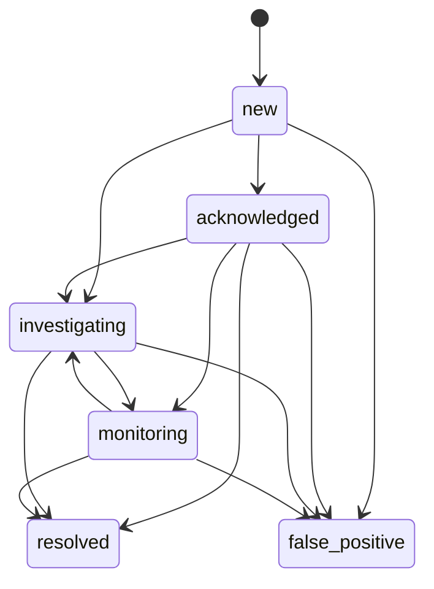

# Policy and incident operations

White Radar 0.3 adds deterministic protocol baselines, auditable incident states, response
deadlines, and process heartbeats. These features improve prioritization and operating discipline;
they do not convert a transaction into proof of malicious intent or authorize active intervention.

## Policy pack

Copy `policies.example.toml` to the ignored operational file `policies.toml`. Each `[[protocols]]`
record is keyed by chain ID and watched contract address.

```toml
schema_version = 1

[[protocols]]
chain_id = 1
address = "0x1111111111111111111111111111111111111111"
protocol = "Example Protocol"
authorized_senders = ["0x2222222222222222222222222222222222222222"]
allowed_selectors = ["0x12345678"]
critical_selectors = ["0x12345678"]
max_native_value_wei = 0
incident_sla_minutes = 15
```

| Field | Effect | Interpretation limit |
|---|---|---|
| `authorized_senders` | Flags an observed sender outside the supplied set | Accounts can rotate or use relayers |
| `allowed_selectors` | Flags a selector outside the supplied set | Proxies and fallback paths may be dynamic |
| `critical_selectors` | Raises priority for an owner-designated sensitive call | Sensitivity is not exploitability |
| `max_native_value_wei` | Flags value above the supplied ceiling | Token transfers are not represented by this field |
| `incident_sla_minutes` | Sets the acknowledgement deadline | An SLA is an operational target, not a legal conclusion |

White Radar rejects malformed addresses and selectors, duplicate contract policies, negative value
limits, non-positive SLAs, unknown schema versions, and files over one megabyte. It records the
policy file SHA-256 on policy-backed pending events. It never executes code from the policy file.

Run `white-radar doctor` after every change. The doctor output reports the number of policies and
their digest without printing credentials.

## Incident lifecycle

Events at or above `incident_minimum_score` are promoted idempotently into incidents. The default
threshold is 70 and the default acknowledgement deadline is 30 minutes. A matching policy can
override the deadline for its contract.



List and update incidents through the local CLI:

```bash
white-radar incidents --status new --limit 50
white-radar incident-transition \
  --incident-id CASE_ID \
  --status acknowledged \
  --actor operator \
  --note "Independent evidence review started."
```

Every transition appends its actor, note, previous state, new state, and timestamp. `resolved` and
`false_positive` are terminal. White Radar does not delete or silently reopen terminal history.

The workflow follows the preparation, detection, response, and recovery principles in
[NIST SP 800-61 Rev. 3](https://csrc.nist.gov/pubs/sp/800/61/r3/final). Event and transition fields
are intentionally structured for consistent analysis in line with the
[OWASP Logging Vocabulary](https://cheatsheetseries.owasp.org/cheatsheets/Logging_Vocabulary_Cheat_Sheet.html).

## Service heartbeats

`confirmed_scanner`, `pending_observer`, and `profile_refresh` write timestamped service records.
The pending observer refreshes its record every 30 seconds while its WebSocket subscription is
active. Exceptions produce a `degraded` state with only the exception class name, preventing an RPC
URL or credential from being copied into the health table.

```bash
white-radar health
white-radar health --stale-after 180
```

The command returns JSON and exits non-zero when there are no heartbeat records, a service is
degraded, or a heartbeat is stale. The included `white-radar-health.timer` runs this check every
minute. A host monitoring system should alert on the failed unit; the local timer cannot report a
complete host outage by itself.

## Safe validation order

1. Run the complete offline suite and secret scan.
2. Configure one test network with a newly issued provider endpoint in the ignored `.env` file.
3. Run `doctor --online`, one bounded confirmed scan, and alert previews.
4. Review policies against an owned or explicitly authorized contract.
5. Validate the pending observer on the test network without broadcasting transactions.
6. Enable one production network in read-only mode and begin with conservative ranges.
7. Observe volume, provider quota, heartbeats, and incident quality before expanding scope.

White Radar never requires a wallet seed phrase, private key, unlocked account, or signing service.
